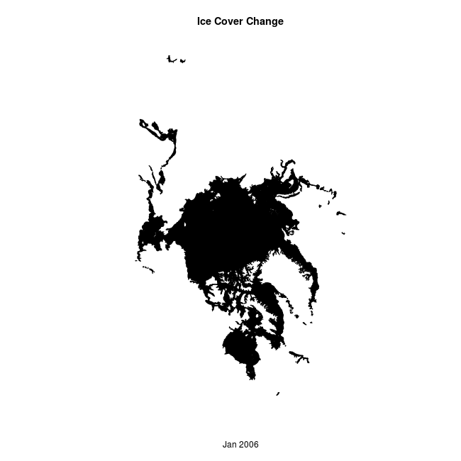
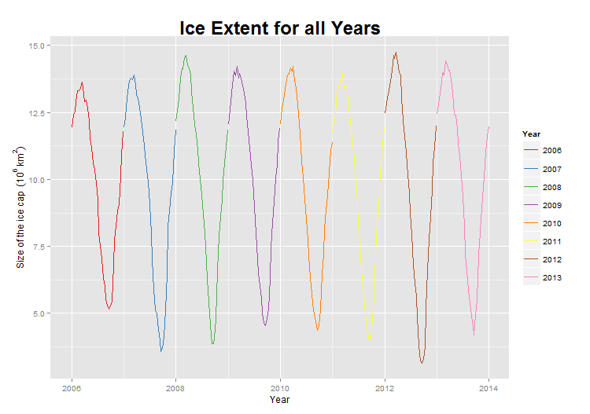
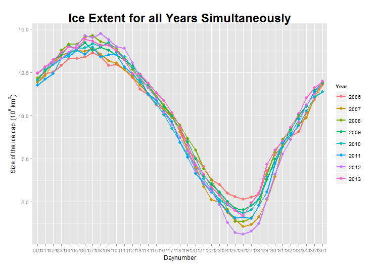
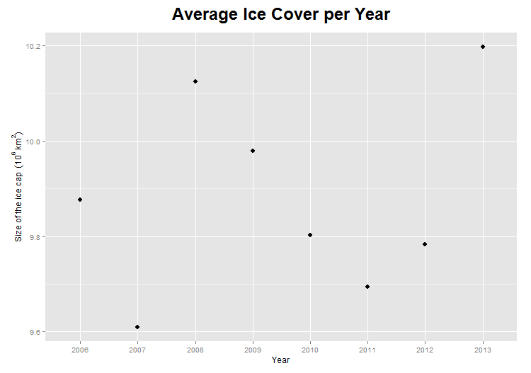
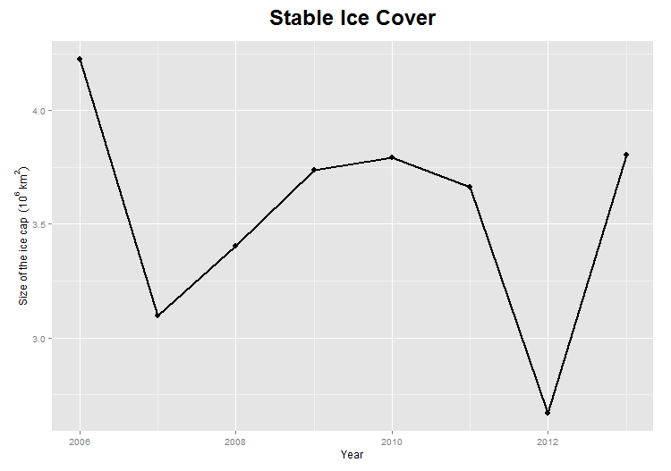

Introduction
============

This document contains all the  scripts we made for the GeoScripting Challenge 2015. For this challenge we looked at data of the ice cap of the Arctic. For each year between 2006 and 2013, data is available for every day. This data was made available by NOAA, the National Oceanic and Atmospheric Administration. Both shapefiles and Geotiff files are available. We decided to work with shapefiles for several reasons. The first and foremost reason is that the tif files were 36 MB each. Since we wanted to download data of every tenth day of all the years, that would amount to approximately 10GB.

With this North Pole data we did several things. For each thing we did, we will explain what our goal was, show the script we wrote to attain our goal, and elaborate some more on the script.


Download the data
=================

First we wanted to write a script to download the data. This is a crucial step in our assignment, because we do not want to have to download all the data seperately, save the zip file, unzip the zipfile and save the data in another directory. to let the computer do this for us, we wrote a script with a for and a while loop. The script begins at 2006, downloads the data in a new directory (which is created, if it doen exist), unzips the zipfile in another new directory (also created if it does not exist) and deletes the zipfile, for we will not need that anymore.
For fun, we also kept track of the number of mouse clicks we would have had, if we had downloaded all this by mouse.

Here is our code to download the data:
```{r, eval=FALSE}
# including libraries
library(raster)
library(downloader)

# download data per year
data_downloader <- function(start_year, end_year,interval){
  counter <- seq(1, 365, by=10)
  year <- 2006
  mc <- 4
  while (year < 2014) {
    current_year <- as.character(year)
    new_dir = paste("data/",current_year,"/", sep="")
    mc <- mc + 4
    dir.create(new_dir, showWarnings = F)
    mc <- mc + 4
    for (i in counter) {
      j <- sprintf("%03d", i)
      day_number <- as.character(j)
      my_url = paste("ftp://sidads.colorado.edu/DATASETS/NOAA/G02186/shapefiles/",current_year,"/masie_ice_r00_v01_",current_year,day_number,"_4km.zip", sep = "", collapse=NULL)
      outputfile = paste("data/",current_year,"/",current_year,day_number,".zip", sep="",collapse=NULL)
      err <- try(download(my_url, outputfile, quiet=T, mode = "wb"))
      if (class(err) == "try-error") {
        i <- i + 1
      } else {
        download(my_url, outputfile, mode = "wb")
      }
      mc <- mc + 15
      zip_output <- paste("data/ice_coverage/", sep="",collapse=NULL)
      unzip(outputfile, exdir=zip_output)
      mc <- mc + 3
    }
    unlink(paste("data/",current_year,sep=""), recursive = T)
    mc <- mc + 5
    year <- year + 1
  }
  print(paste("Mouse-clicks we avoided = ",mc, sep=""))
  print("DONE")
}
```

For in case you were wondering: the mouse clicks we avoided are: 5436!!

Visualize the data
==================

Secondly we wanted to visualize the data. One way we thought about was plotting the shapefiles of all the years sequentially. We first had some trouble doing this, because we thought about plotting the shapefiles and setting the add parameter to true. But then we found the saveGIF function, which makes a GIF image of a plot sequence. This worked very well and we are very proud about the result. This is the code we used, and the resulting GIF.

```{r, eval=FALSE}
#required packages
library(rgdal)
library(maptools)
library(animation)
library(stringr)

#starting the function
map_maker <- function(){
  files <- list.files(path='data/ice_coverage',pattern=glob2rx("*.shp"))
  n <- length(files)
  file <- readShapeSpatial(paste("data/ice_coverage/",files[1], sep=""))
  coords<-file@bbox
  xmin<-coords[1,1]
  xmax<-coords[1,2]
  ymin<-coords[2,1]
  ymax<-coords[2,2]
  ptm <- proc.time()
  saveGIF({
    for(i in 1:n){
      file <- readShapeSpatial(paste("data/ice_coverage/",files[i], sep=""))
      temp <- gregexpr("[0-9]+", files[i])
      numbers <- as.numeric(unique(unlist(regmatches(files[i], temp))))
      date <- numbers[3]
      day <- str_sub(date, start=-3)
      year <- str_sub (date, end=4)
      YMD_date <- as.Date(paste(year,"-",day, sep=""), format="%Y-%j")
      MD_date <- format(YMD_date, format=("%b %Y"))
      plot(file, col="black", xlim=c(xmin, xmax), ylim=c(ymin, ymax), main="Ice Cover Change", xlab=MD_date)
    }
  }, movie.name = "ice_cover_change.gif", img.name = "Ice_Cover", interval = 0.1, ani.width = 650, ani.height = 650, clean =T)
  proc.time() - ptm
  print("DONE")
}
```



Calculate and plot the ice cap areas
====================================

Thirdly, we wanted to see if the ice cap decreases over the years. To do this, we first looked at the data for a single year. After that we plotted all the years after one another. From this script we get three graphs:
1. A figure containing graphs for all years, plotting the ice cap area on the y-axis and the daynumber on the x-axis.
2. A graph for all the consecutive years, with the average ice cap area on the y-axis and the years on the x-axis.
3. A figure containing the averae ice cover per year.

```{r, eval=FALSE}
library (rgeos)
library(rgdal)
library (raster)
library(maptools)
library(stringr)
library(lubridate)
library(ggplot2)

# Creating a dataframe containing the area of ice cover for each shapefile
area <- function(){
  files <- list.files(path='data/ice_coverage',pattern=glob2rx("*.shp"))
  n <- length(files)
  table1 <- data.frame(id=numeric(n), date=as.Date(NA), Year=numeric(n), month=as.character(n), daynr=numeric(n), area = numeric(n), stringsAsFactors = FALSE)
  for(i in 1:n){
    layer1 <- str_sub(files[i], end=-5)
    file <- readOGR(dsn = paste("data/ice_coverage/",files[i], sep=""), layer = layer1)
    temp <- gregexpr("[0-9]+", files[i])
    numbers <- as.numeric(unique(unlist(regmatches(files[i], temp))))
    date <- numbers[3]
    day <- str_sub(date, start=-3)
    year <- str_sub (date, end=4)
    table1$id[i] <- i
    table1$Year[i] <- year
    table1$daynr[i] <- day
    table1$date[i] <- as.Date(paste(table1$Year[i],"-",table1$daynr[i], sep=""), format="%Y-%j")
    table1$month[i] <- month(ymd(table1$date[i]), label=TRUE, abbr=TRUE)
    table1$area[i] <- (gArea(file)/1000000000000)
  }
  table1
}

# 1. Plotting all years after each other, with different colours
ggplot(table1, aes(date, area)) + geom_line(aes(colour = Year)) + 
  ggtitle("Ice extent Arctic") + 
  xlab("Year") + ylab(expression("Size of the ice cap " ~ (10^{6} ~ km^{2}))) + 
  theme(plot.title = element_text(lineheight=.8, size=rel(2), face="bold", vjust=0.35))+
  scale_color_brewer(palette="Set1")
```



```{r, eval=FALSE}
# 2. Plotting all years simultaneously
ggplot(data=table1, aes(x=daynr, y=area, group=Year, colour=Year)) + 
  ggtitle("Ice extent Arctic") + 
  theme(plot.title = element_text(lineheight=.8, size=rel(2), face="bold", vjust=0.35))+
  xlab("Daynumber") + ylab(expression("Size of the ice cap " ~ (10^{6} ~ km^{2}))) +
  geom_line(size=1) + 
  geom_point(size=3, fill="white") +
  scale_shape_manual(values=c(22,21))
```



```{r, eval=FALSE}
# 3. Calculating and plotting the average ice cover per year
icecover_years <- aggregate(table1$area, list(Years=table1$Year), mean)
icecover_years <- rename(icecover_years, c("x"="area"))

ggplot(data=icecover_years, aes(x=Years, y=area)) + 
  ggtitle("Average Ice Cover per Year") + 
  theme(plot.title = element_text(lineheight=.8, size=rel(2), face="bold", vjust=2.0))+
  xlab("Year") + ylab(expression("Size of the ice cap " ~ (10^{6} ~ km^{2}))) +
  geom_line(size=5) + 
  geom_point(size=3, fill="white") +
  scale_shape_manual(values=c(22,21))
```


We also wanted to see if the stable ice cap changes over the years. We determined the stable ice cover by looking at which parts of the ice are always present. Calculating the area of this stable ice cover for each year, and comparing that amount with all the other years, we can determine if the total stable ice cover area decreases or not.

Having downloaded only shapefiles and knowing that the available tif files are too large to work with, we decided to convert the shapefiles into our own rasters. We do this in a for loop, loading a shapefile in memory, rasterizing it and intersecting it with the next shapefile which was loaded into memory and rasterized. This is the code we wrote to do this:

```{r, eval=FALSE}
library(rgdal)
library(tiff)
library(raster)
library(stringr)

#setting variables
year <- 2006
ext <-  extent (-3500000, 3000000, -4500000, 3000000)
r <- raster(ext, ncol=600, nrow=600)
new_dir = "data/stable_ice"
dir.create(new_dir, showWarnings = F)

# creating rasters from the shapefiles and overlaying them. One raster, representing the stable ice cap
# is created for each year.
while (year < 2014) {  
  files <- list.files(path='data/ice_coverage/',pattern=glob2rx(paste("*",year,"*.shp",sep="")))
  n <- length(files)
  for(i in 1:n){
    layer1 <- str_sub(files[i], end=-5)
    file1 <- readOGR(dsn=paste("data/ice_coverage/",files[i], sep=""), layer=layer1)
    raster1 <- rasterize(file1, r)
    raster1[raster1 >= 1] <- 1
    if (i==1) {
      file2 <- readOGR(dsn=paste("data/ice_coverage/",files[i], sep=""), layer=layer1)
      raster2 <- rasterize(file2, r)
      raster2[raster2 >= 1] <- 1
      multiplication <- raster1*raster2
    }
    else {
      multiplication <- multiplication*raster1
    }  
  }
  outputfilename <- paste("data/stable_ice/stable_ice_",year,".tif", sep="")
  writeRaster(multiplication, filename=outputfilename, format="GTiff", dataype='LOG1S')
  year <- year + 1
}  
```

Furthermore we also made a Dataframe of the this data and plotted that in a graph:

```{r, eval=FALSE}
library(raster)
library(rgdal)
library(tiff)

# calculating the area of each of the .tif files which contain the stable ice cap. The ice area for
# each year is saved in a dataframe.
files <- list.files(path='data/stable_ice/',pattern=glob2rx("*.tif"))
n <- length(files)
table2 <- data.frame(id=numeric(n), year=numeric(n), area = numeric(n), stringsAsFactors = FALSE)
for(i in 1:n){
  layer1 <- str_sub(files[i], end=-5)
  file1 <- readGDAL(paste("data/stable_ice/",files[i], sep=""))
  file1<-raster(file1)
  temp <- gregexpr("[0-9]+", files[i])
  year <- as.numeric(unique(unlist(regmatches(files[i], temp))))
  cells <- freq(file1)
  icecells <- as.numeric(cells[1,2])
  areaice <- ((icecells*10833.33*12500)/1000000000000)
  table2$id[i] <- i
  table2$year[i] <- year
  table2$area[i] <- areaice
}

# The stable ice surface is plotted against the years
ggplot(data=table2, aes(x=year, y=area)) + 
  ggtitle("Ice extent Arctic") + 
  theme(plot.title = element_text(lineheight=.8, size=rel(2), face="bold", vjust=2.0))+
  xlab("Year") + ylab(expression("Size of the ice cap " ~ (10^{6} ~ km^{2}))) +
  geom_line(size=1) + 
  geom_point(size=3, fill="white") +
  scale_shape_manual(values=c(22,21))

```

