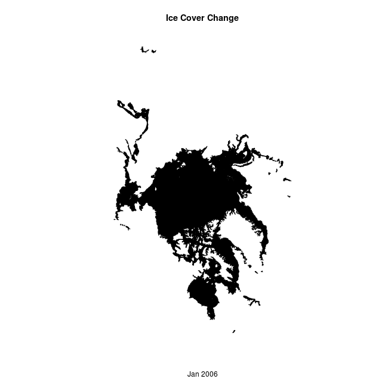
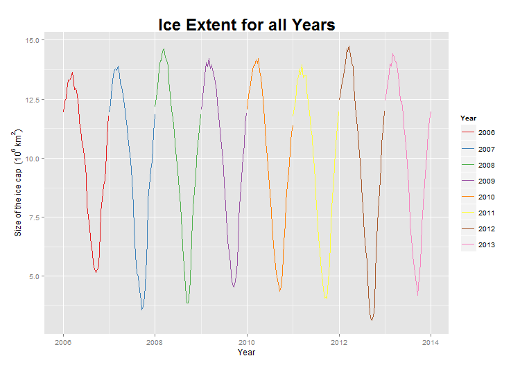
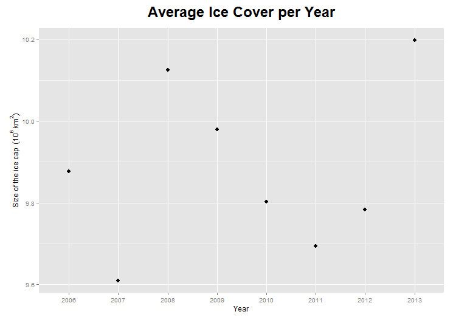

IceCover
========================================================
author: Janna Jilesen & Stefan van Dam || Team Raspberries
date: 30 January 2015
css: Presentation/custom.css
**Investigating Ice Cap Changes**

Introduction
========================================================
class: intro
incremental: true
- Our Goal
- Script Snippets and visualization
- Questions?

Our Goal
========================================================
incremental: true
Having 365 times 8 shapefiles of the Arctic  
What to do with it?
- First: download the data via script
- Then: performing calculations on the data
- And visualize the data

First step: Download the data
========================================================
class: small-code
incremental: true
<div class="small-text">We wanted a reproducible script that automizes this process</div>

```r
counter <- seq(1, 365, by = 10)
year <- 2006
while (year < 2014) {
    current_year <- as.character(year)
    new_dir = paste("data/", current_year, "/", sep = "")
    dir.create(new_dir, showWarnings = F)
    for (i in counter) {
        j <- sprintf("%03d", i)
        day_number <- as.character(j)
        my_url = paste("http://url/", current_year, "/masie_ice_r00_v01_", current_year, 
            day_number, "_4km.zip", sep = "", collapse = NULL)
        outputfile = paste("data/", current_year, "/", current_year, day_number, 
            ".zip", sep = "", collapse = NULL)
        err <- try(download(my_url, outputfile, quiet = T, mode = "wb"))
        if (class(err) == "try-error") {
            i <- i + 1
        } else {
            download(my_url, outputfile, mode = "wb")
        }
        zip_output <- paste("data/ice_coverage/", sep = "", collapse = NULL)
        unzip(outputfile, exdir = zip_output)
    }
    unlink(paste("data/", current_year, sep = ""), recursive = T)
    year <- year + 1
}
```

========================================================
incremental: true
The mouse clicks we avoided by automization are:

> <center>five thousand four hundred thirty six!  
> 5436</center>

Code to make a GIF image
=======================================================
class: small-code

```r
saveGIF({
    for (i in 1:n) {
        file <- readShapeSpatial(paste("data/ice_coverage/", files[i], sep = ""))
        temp <- gregexpr("[0-9]+", files[i])
        numbers <- as.numeric(unique(unlist(regmatches(files[i], temp))))
        date <- numbers[3]
        day <- str_sub(date, start = -3)
        year <- str_sub(date, end = 4)
        YMD_date <- as.Date(paste(year, "-", day, sep = ""), format = "%Y-%j")
        MD_date <- format(YMD_date, format = ("%b %Y"))
        plot(file, col = "black", xlim = c(xmin, xmax), ylim = c(ymin, ymax), 
            main = "Ice Cover Change", xlab = MD_date)
    }
}, movie.name = "ice_cover_change.gif", img.name = "Ice_Cover", interval = 0.1, 
    ani.width = 650, ani.height = 650, clean = T)
```

GIF image of the shapefiles
==========================================================
class: midcenter


Performing calculations on the data
========================================================
incremental: true
With the downloaded .shp files we did the following:
- calculated the area of the ice cap of each shapefile
- saved it in a table
- plotted the area against the date

Graph of the ice cap area for the different years
========================================================
class: middcenter


Ice extent for all years simultaneously
=========================================================
class: middcenter


Plotting the average ice cap area
=========================================================
class: middcenter


Change in Stable Ice Cap
==========================================================
class: small-code

```r
while (year < 2014) {
    files <- list.files(path = "wd", pattern = glob2rx(paste("*", year, "*.shp", 
        sep = "")))
    n <- length(files)
    for (i in 1:n) {
        layer1 <- str_sub(files[i], end = -5)
        file1 <- readOGR(dsn = paste("wd", files[i], sep = ""), layer = layer1)
        raster1 <- rasterize(file1, r)
        raster1[raster1 >= 1] <- 1
        if (i == 1) {
            file2 <- readOGR(dsn = paste("wd", files[i], sep = ""), layer = layer1)
            raster2 <- rasterize(file2, r)
            raster2[raster2 >= 1] <- 1
            multiplication <- raster1 * raster2
        } else {
            multiplication <- multiplication * raster1
        }
    }
    outputfilename <- paste("wd/stable_ice_", year, ".tif", sep = "")
    writeRaster(multiplication, filename = outputfilename, format = "GTiff", 
        dataype = "LOG1S")
    year <- year + 1
}
```

Change in Stable Ice Cap
========================================================
class: middcenter


Key things we learned
========================================================
incremental: true
- avoiding mouse clicks :-)
- making GIF images from plots
- reading, processing and writing vector and raster data in R
- solving problems (GOOGLE!)
